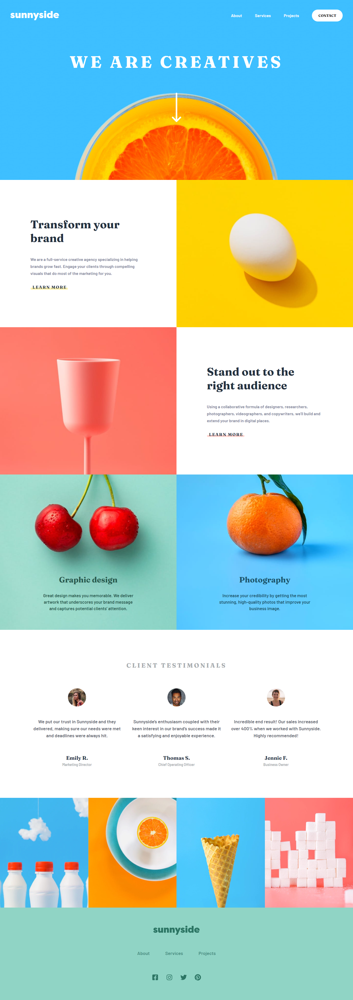

# Frontend Mentor - Sunnyside agency landing page solution

This is a solution to the [Sunnyside agency landing page challenge on Frontend Mentor](https://www.frontendmentor.io/challenges/sunnyside-agency-landing-page-7yVs3B6ef). Frontend Mentor challenges help you improve your coding skills by building realistic projects.

## Table of contents

- [Overview](#overview)
  - [The challenge](#the-challenge)
  - [Screenshot](#screenshot)
  - [Links](#links)
- [My process](#my-process)
  - [Built with](#built-with)
  - [What I learned](#what-i-learned)
  - [Useful resources](#useful-resources)
- [Author](#author)

**Note: Delete this note and update the table of contents based on what sections you keep.**

## Overview

### The challenge

Users should be able to:

- View the optimal layout for the site depending on their device's screen size
- See hover states for all interactive elements on the page

### Screenshot


[📱 Mobile Version](./mobile.png)

### Links

- 📌 Solution URL: [Solution](https://github.com/arrizkyhp/fm-sunnyside-agency-landing-page)
- 🎪 Live Site URL: [Live Site](https://arrizkyhp.github.io/fm-sunnyside-agency-landing-page/)

## My process

### Built with

- Semantic HTML5 markup
- CSS custom properties
- Flexbox
- CSS Grid
- BEM naming
- [Sass](https://sass-lang.com/) - CSS extension
- [GulpJS](https://gulpjs.com/) - JS library
- [ReactJS](https://reactjs.org/) - JS library

### What I learned

This challenge i learned how to make hamburger button on mobile view.

because i'm using reactjs, i used useState for toggle hamburger checkbox

```html
<div id="menuToggle">
  <input type="checkbox" onClick="{showMenu}" />
  <div className="hamburger">
    <span></span>
    <span></span>
    <span></span>
  </div>
</div>
```

```scss
#menuToggle {
  display: none;
  position: relative;

  @include breakpoint-max(md) {
    display: block;
  }

  input {
    position: absolute;
    display: block;
    cursor: pointer;
    width: 40px;
    height: 32px;
    top: 0;
    left: rem(-4);
    z-index: 2;
    opacity: 0;

    -webkit-touch-callout: none;
    -webkit-tap-highlight-color: transparent;

    &:focus {
      outline: none;
    }

    &:checked + .hamburger span {
      transform: rotate(45deg) translate(-2px, -1px);
    }

    &:checked + .hamburger span:nth-child(2) {
      opacity: 0;
      transform: rotate(0deg) scale(0.2, 0.2);
    }

    &:checked + .hamburger span:nth-child(3) {
      transform: rotate(-45deg) translate(0, -1px);
      top: rem(3);
    }
  }

  .hamburger {
    span {
      display: block;
      width: rem(34);
      height: rem(4);
      margin-bottom: rem(5);
      position: relative;
      background: $white;
      border-radius: rem(3);
      transform-origin: 4px 0px;

      transition: transform 0.5s cubic-bezier(0.77, 0.2, 0.05, 1), background 0.5s cubic-bezier(0.77, 0.2, 0.05, 1), opacity 0.55s ease;

      &:first-child {
        transform-origin: 0% 0%;
      }

      &:last-child {
        transform-origin: 0% 100%;
      }
    }
  }
}
```

```js
import React, { useState } from 'react'

export default function Nav(props) {
    const [checked, isChecked] = useState(false)

    .....


    const showMenu = () => {
      isChecked(!checked);
      console.log(checked)
    }
```

### Useful resources

- [Pure CSS Hamburger fold-out menu](https://codepen.io/erikterwan/pen/EVzeRP) - This helped me for Hamburger icon on mobile view.

- [Responsive topnav](https://www.w3schools.com/howto/tryit.asp?filename=tryhow_js_topnav) - This helped me for Hamburger icon on mobile view.

## Author

- Github - [arrizkyhp](https://github.com/arrizkyhp)
- Frontend Mentor - [@arrizkyhp](https://www.frontendmentor.io/profile/arrizkyhp)
- Twitter - [@arrizkyhp](https://twitter.com/arrizkyhp)
